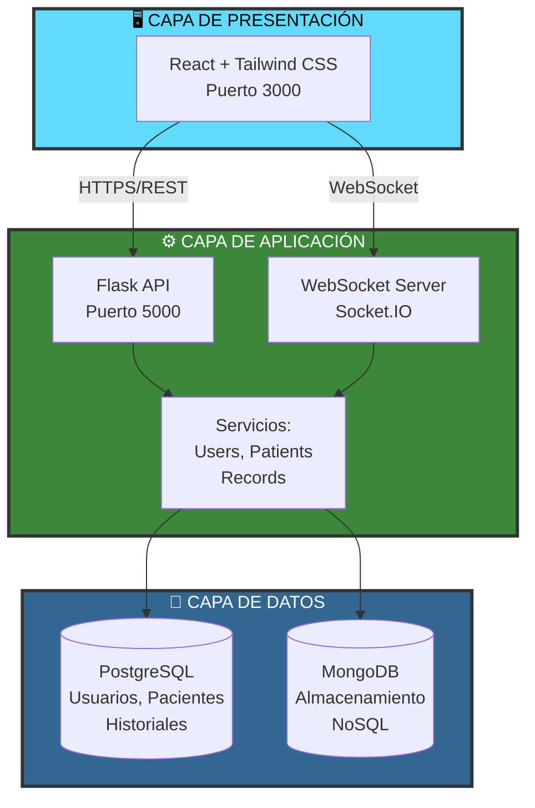
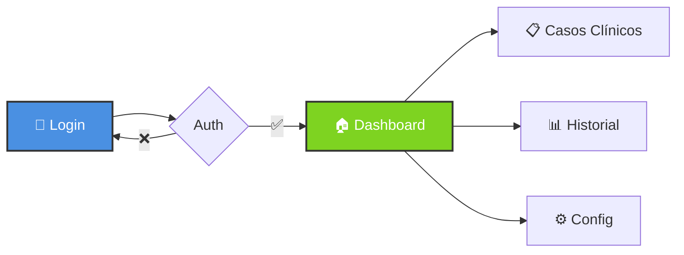
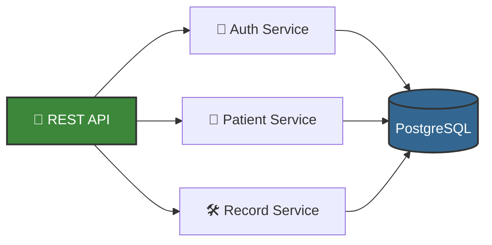
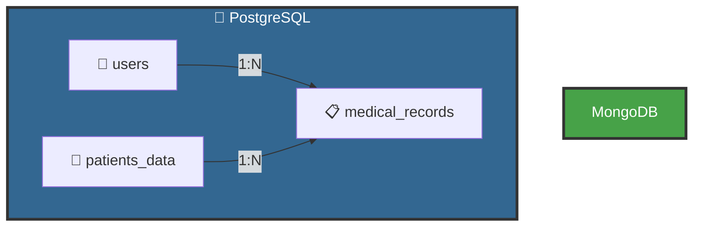
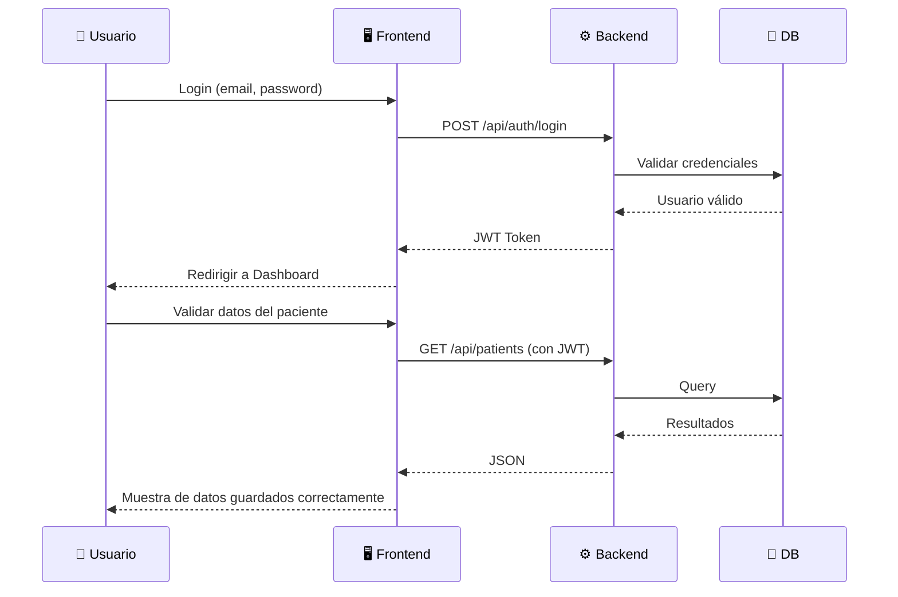

# 🏥 dIAgnose

### Sistema de Gestión Hospitalaria

---

## 🎯 ¿Qué es dIAgnose?

**dIAgnose** es nuestra solución para modernizar la gestión hospitalaria. Básicamente, es una aplicación web que permite a médicos gestionar datos de pacientes, validar historiales y guardarlos para su posterior visualización.

### ✨ Lo que puedes hacer con dIAgnose

- 👥 **Gestionar datos de pacientes**: visualizar datos de pacientes, actualizar datos, buscar historiales rápidamente
- 🔐 **Acceso seguro**: autenticación con JWT y control de permisos según tu rol
- 📊 **Historial médico**: registro completo de datos del paciente y tratamientos
- 📱 **Responsive**: funciona en ordenadores, tablets y móviles

---

## 🏗️ Arquitectura del Sistema

Hemos diseñado dIAgnose con una arquitectura de **tres capas** clásica pero efectiva: frontend en React, backend en Flask y dos bases de datos (PostgreSQL para datos estructurados y MongoDB para almacenamiento flexible).

---

## 🎨 Componentes del Sistema

### Frontend con React

Hemos construido la interfaz con React y Tailwind CSS. El flujo es sencillo: te logueas, llegas al dashboard y desde ahí puedes acceder a gestión de pacientes, historial médico o configuración (si eres admin).

### Backend con Flask

El backend es una API REST en Flask que maneja toda la lógica de negocio. Usa SQLAlchemy como ORM para SQLite. La autenticación va con JWT y las contraseñas están encriptadas con bcrypt. Existe soporte opcional para servicios en tiempo real mediante WebSockets (Flask-SocketIO).

---

## 💾 Bases de Datos

Usamos SQLite como motor de base de datos, gracias a su integración con SQLAlchemy, nos permite realizar múltiples acciones

---

## 🔄 Cómo Funciona

El flujo típico es bastante directo: te autenticas con tu email y contraseña, el backend genera un JWT que guardas en el navegador, y con ese token haces todas las peticiones a la API.

---

## 🛠️ Stack Tecnológico

### Frontend
- **React 18.2+** con Vite como bundler (mucho más rápido que Create React App)
- **Tailwind CSS** para los estilos
- **Axios** para las llamadas a la API
- **Socket.io Client** (opcional) para servicios en tiempo real

### Backend
- **Python 3.11.+** con **Flask 2.0+**
- **SQLAlchemy** como ORM para SQLite
- **Flask-SocketIO** (opcional) para soporte de WebSockets
- **PyJWT** para generar y validar tokens
- **Bcrypt** para hashear contraseñas

### Bases de Datos
- **SQLite 3.43.+** para datos estructurados

### Herramientas
- Git para control de versiones
- ESLint para mantener el código limpio
- Postman para testear la API

---

## 📚 Glosario Rápido

Por si no estás familiarizado con algún término:

- **API REST**: La forma en que el frontend y backend se comunican usando HTTP (GET, POST, PUT, DELETE)
- **JWT**: Un token que se genera al hacer login y se envía en cada petición para autenticarte
- **WebSocket**: Conexión que se mantiene abierta para enviar/recibir datos en tiempo real
- **ORM**: Una librería que te permite trabajar con la base de datos usando objetos en lugar de SQL puro

---

## 👥 Equipo

Este proyecto lo estamos desarrollando entre dos equipos de estudiantes de 2º DAM en el IES Ribera del Tajo.

### Equipos de Desarrollo

| **LosMasones** 🔷 | **MediScout** 🔶 |
|:-------------------|:-----------------|
| **Héctor de la Llave Ballesteros** *(Project Leader)* | **Josue Mejías Morante** *(Project Leader)* |
| Pablo Moreno Márquez | Rubén Cadalso Fernández |
| Carlos López Tronco | Rubén Serrejón Porras |
| Abel González Palencia | |

---

## 📄 Documentación

**dIAgnose** - Sistema de Gestión Hospitalaria  
*Proyecto Intermodular 2º DAM 2025-2026*  
*IES Ribera del Tajo*

