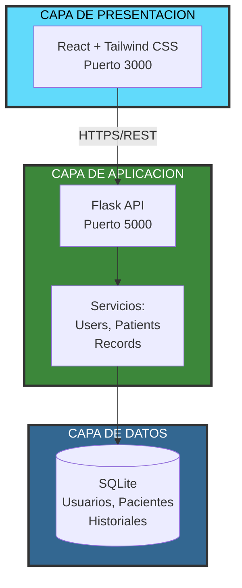
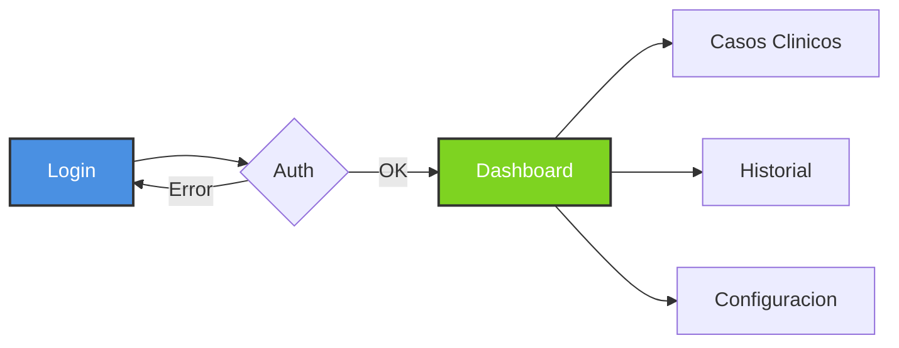
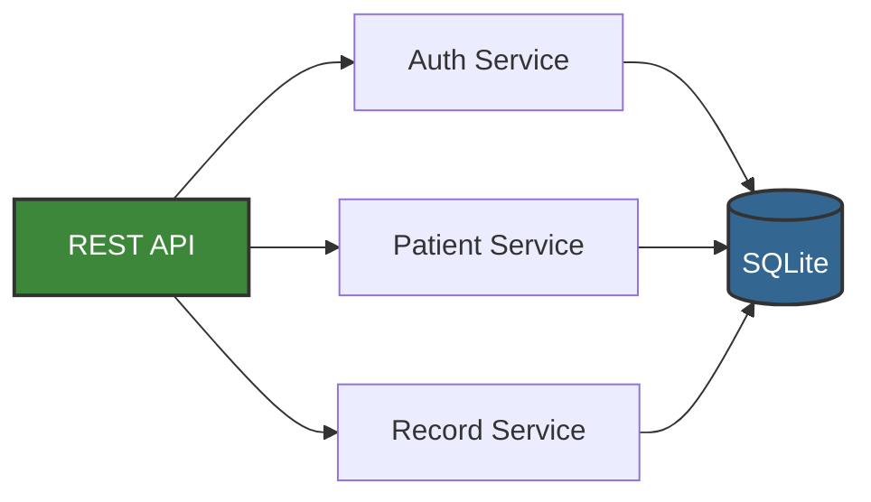
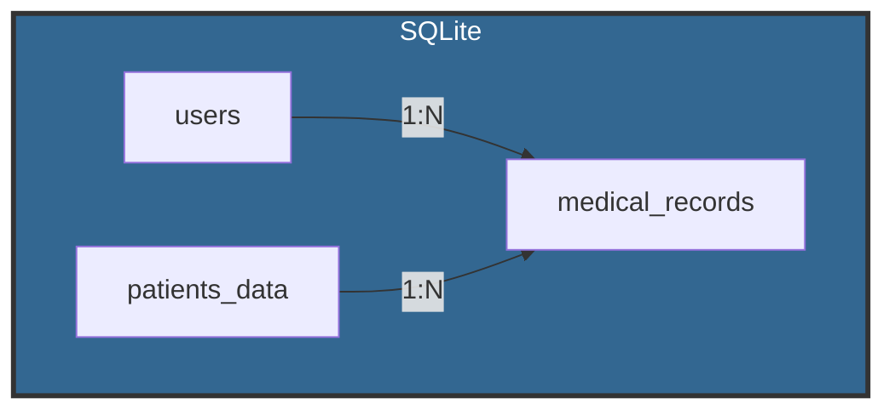
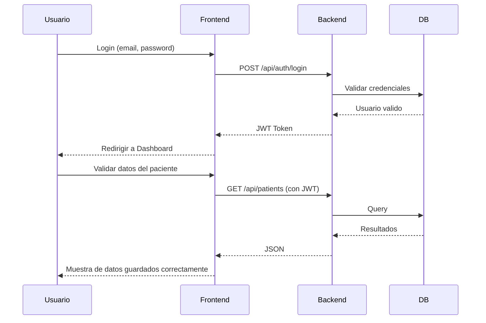

# dIAgnose

### Sistema de Gestion Hospitalaria

---

## Que es dIAgnose

**dIAgnose** es una aplicacion web para modernizar la gestion hospitalaria. Permite a personal medico gestionar datos de pacientes, validar historiales y guardarlos para su posterior visualizacion.

### Funcionalidades principales

- **Gestionar datos de pacientes**: visualizar, actualizar y consultar historiales con rapidez.
- **Acceso seguro**: autenticacion con JWT y control de permisos segun el rol.
- **Historial medico**: registro completo de datos clinicos y tratamientos.
- **Interfaz responsive**: funciona en ordenadores, tablets y moviles.

---

## Arquitectura del Sistema

dIAgnose sigue una arquitectura de tres capas: frontend en React, backend en Flask y persistencia de datos en SQLite. El diseño se centra en separacion de responsabilidades y mantenimiento sencillo.

```mermaid
graph TB
    subgraph Client["CAPA DE PRESENTACION"]
        UI[React + Tailwind CSS<br/>Puerto 3000]
    end

    subgraph API["CAPA DE APLICACION"]
        Flask[Flask API<br/>Puerto 5000]

        Services[Servicios:<br/>Users, Patients<br/>Records]
    end

    subgraph Database["CAPA DE DATOS"]
        SQLite[(SQLite<br/>Usuarios, Pacientes<br/>Historiales)]
    end

    UI -->|HTTPS/REST| Flask

    Flask --> Services

    Services --> SQLite

    style Client fill:#61dafb,stroke:#333,stroke-width:3px,color:#000
    style API fill:#3c873a,stroke:#333,stroke-width:3px,color:#fff
    style Database fill:#336791,stroke:#333,stroke-width:3px,color:#fff
```

---

## Componentes del Sistema

### Frontend con React

La interfaz se ha desarrollado con React y Tailwind CSS. El flujo de uso es directo: inicio de sesion, acceso al dashboard y navegacion hacia gestion de pacientes, historial medico o configuracion (si el usuario tiene rol administrador).

```mermaid
graph LR
    A[Login] --> B{Auth}
    B -->|OK| C[Dashboard]
    B -->|Error| A
    C --> D[Casos Clinicos]
    C --> F[Historial]
    C --> G[Configuracion]

    style A fill:#4A90E2,stroke:#333,stroke-width:2px,color:#fff
    style C fill:#7ED321,stroke:#333,stroke-width:2px,color:#fff
```

### Backend con Flask

El backend es una API REST con Flask. La logica de negocio se gestiona con servicios y repositorios. SQLAlchemy actua como ORM para SQLite. La autenticacion utiliza JWT y las contraseñas se almacenan con bcrypt.

```mermaid
graph LR
    API[REST API] --> Auth[Auth Service]
    API --> Patient[Patient Service]
    API --> Record[Record Service]

    Auth --> SQLite[(SQLite)]
    Patient --> SQLite
    Record --> SQLite

    style API fill:#3c873a,stroke:#333,stroke-width:2px,color:#fff
    style SQLite fill:#336791,stroke:#333,stroke-width:2px,color:#fff
```

---

## Bases de Datos

El proyecto usa SQLite como motor de base de datos. Su integracion con SQLAlchemy permite gestionar datos estructurados de forma simple en un archivo local.

```mermaid
graph TB
    subgraph SQLite["SQLite"]
        Users[users]
        Patients_data[patients_data]
        Records[medical_records]
    end

    Users -->|1:N| Records
    Patients_data -->|1:N| Records

    style SQLite fill:#336791,stroke:#333,stroke-width:3px,color:#fff
```

---

## Como Funciona

El flujo de trabajo es el siguiente: el usuario se autentica, el backend genera un JWT y el frontend lo utiliza en las peticiones a la API para consultar o guardar datos.

```mermaid
sequenceDiagram
    participant U as Usuario
    participant F as Frontend
    participant B as Backend
    participant D as DB

    U->>F: Login (email, password)
    F->>B: POST /api/auth/login
    B->>D: Validar credenciales
    D-->>B: Usuario valido
    B-->>F: JWT Token
    F-->>U: Redirigir a Dashboard

    U->>F: Validar datos del paciente
    F->>B: GET /api/patients (con JWT)
    B->>D: Query
    D-->>B: Resultados
    B-->>F: JSON
    F-->>U: Muestra de datos guardados correctamente
```

---

## Stack Tecnologico

### Frontend
- **React 18.2+** con Vite como bundler.
- **Tailwind CSS** para estilos.
- **Fetch API** para llamadas a la API.

### Backend
- **Python 3.11.+** con **Flask 2.0+**.
- **SQLAlchemy** como ORM para SQLite.
- **PyJWT** para generar y validar tokens.
- **Bcrypt** para almacenar contraseñas.

### Bases de Datos
- **SQLite 3.43.+** para datos estructurados.

### Herramientas
- Git para control de versiones.
- ESLint para mantener el codigo limpio.
- Postman para pruebas de API.

---

## Glosario Rapido

- **API REST**: comunicacion entre frontend y backend mediante HTTP.
- **JWT**: token de autenticacion que se envia en cada peticion.
- **WebSocket**: conexion persistente para intercambio en tiempo real.
- **ORM**: libreria que permite operar con la base de datos usando objetos.

---

## Equipo

Proyecto desarrollado por dos equipos de estudiantes de 2o DAM en el IES Ribera del Tajo.

### Equipos de Desarrollo

| **LosMasones** | **MediScout** |
|:-------------------|:-----------------|
| **Hector de la Llave Ballesteros** *(Project Leader)* | **Josue Mejias Morante** *(Project Leader)* |
| Pablo Moreno Marquez | Ruben Cadalso Fernandez |
| Carlos Lopez Tronco | Ruben Serrejon Porras |
| Abel Gonzalez Palencia | |

---

## Documentacion

**dIAgnose** - Sistema de Gestion Hospitalaria  
*Proyecto Intermodular 2o DAM 2025-2026*  
*IES Ribera del Tajo*

