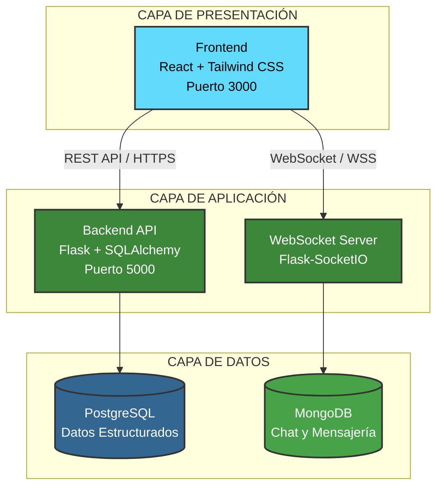
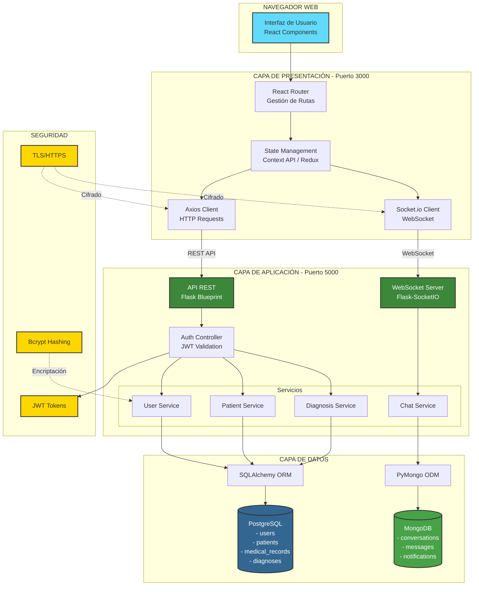

# Software Requirements Specification (SRS)

## dIAgnose - Sistema de Diagnóstico Médico Asistido por IA

**Versión:** 1.0  
**Fecha:** 08/11/2025  
**Preparado por:** LosMasones y MediScout  
**Organización:** IES Ribera del Tajo - Proyecto 2DAM/DAW/IA

---

## Historial de Revisiones

| Fecha | Versión | Descripción | Autor |
|-------|---------|-------------|-------|
| 08/11/2025 | 1.0 | Creación inicial del documento | Equipos desarrollo |

---

## 1. Introducción

### 1.1 Propósito

Este documento especifica los requisitos del sistema dIAgnose, aplicación hospitalaria que integra inteligencia artificial para asistir en el diagnóstico médico. El documento está dirigido al equipo de desarrollo, profesores evaluadores y potenciales usuarios del sistema.

### 1.2 Alcance

dIAgnose es una aplicación web hospitalaria que combina análisis médico tradicional con asistencia de inteligencia artificial.

**Funcionalidades principales:**
- Diagnóstico asistido por IA basado en síntomas del paciente
- Gestión completa de historiales médicos
- Sistema de mensajería en tiempo real entre profesionales
- Control de acceso basado en roles
- Seguimiento de consultas y tratamientos

**Exclusiones de la versión 1.0:**
- Integración con sistemas de facturación
- Gestión de citas médicas
- Recetas electrónicas
- Videoconsulta

### 1.3 Definiciones y Acrónimos

| Término | Definición |
|---------|------------|
| API | Application Programming Interface |
| JWT | JSON Web Token |
| REST | Representational State Transfer |
| CRUD | Create, Read, Update, Delete |
| IA | Inteligencia Artificial |
| RGPD | Reglamento General de Protección de Datos |
| Embeddings | Representaciones numéricas de conceptos médicos |
| WebSocket | Protocolo de comunicación bidireccional en tiempo real |

### 1.4 Referencias

- IEEE 830-1998 / ISO/IEC/IEEE 29148
- RGPD (EU 2016/679)
- Ley Orgánica 3/2018 de Protección de Datos
- Documentación del proyecto: https://github.com/dIAgnoseTeam/dIAgnose

---

## 2. Descripción General

### 2.1 Perspectiva del Producto

dIAgnose es un sistema independiente construido sobre arquitectura de tres capas:

**Componentes de base de datos:**
- PostgreSQL: datos estructurados de usuarios y pacientes
- MongoDB: mensajes de chat y conversaciones

### 2.2 Funciones del Producto

**Módulos del sistema:**

| Módulo | Descripción | Acceso |
|--------|-------------|--------|
| Login | Autenticación segura con JWT | Todos |
| Dashboard | Panel principal personalizado por rol | Autenticados |
| Configuración | Gestión de parámetros y usuarios | Administradores |
| Historial | Consulta de historiales médicos | Médicos y enfermeros |
| Chat | Mensajería instantánea | Todos los autenticados |
| Gestión Pacientes | CRUD de información de pacientes | Personal autorizado |
| Diagnóstico IA | Asistente de diagnóstico | Médicos |

### 2.3 Características de los Usuarios

| Rol | Funciones | Permisos |
|-----|-----------|----------|
| Administrador | Gestión de usuarios, configuración del sistema, acceso a logs | Total |
| Médico | Gestión de pacientes, uso de diagnóstico IA, consulta de historiales | Completo sobre pacientes |
| Enfermero | Consulta de historiales, actualización de signos vitales | Lectura y escritura limitada |
| Administrativo | Registro de pacientes, gestión de datos básicos | Solo datos no clínicos |

### 2.4 Restricciones

**Legales y normativas:**
- Cumplimiento estricto de RGPD
- Confidencialidad de datos médicos
- El diagnóstico final es responsabilidad del médico

**Técnicas:**
- Backend: Python 3.9+ con Flask
- Frontend: React 18+
- Bases de datos: PostgreSQL 13+, MongoDB 5+

**De proyecto:**
- Entorno académico con recursos limitados
- Equipo de 7 desarrolladores estudiantes
- Plazo académico 2025-2026

### 2.5 Suposiciones y Dependencias

**Suposiciones:**
- Conexión estable a Internet
- Dispositivos compatibles (PC, tablet)
- Formación básica de usuarios antes del uso
- Infraestructura de red hospitalaria funcional

**Dependencias externas:**
- Servicio de hosting (AWS, Azure, Google Cloud)
- Frameworks: React, Tailwind, Flask, SQLAlchemy
- Bases de datos: PostgreSQL, MongoDB

---

## 3. Requisitos Específicos

### 3.1 Requisitos Funcionales

#### RF-001: Autenticación y Control de Acceso

**Inicio de sesión:**
- Autenticación mediante email y contraseña encriptada (bcrypt)
- Generación de token JWT válido por 8 horas
- Bloqueo temporal (5 minutos) tras 3 intentos fallidos
- Registro en logs de todos los intentos de acceso

**Control de acceso:**
- Verificación de permisos en cada funcionalidad
- Registro de intentos de acceso no autorizado

**Cierre de sesión:**
- Invalidación de token JWT
- Eliminación de datos sensibles del cliente
- Registro en logs de auditoría

#### RF-002: Gestión de Pacientes

**Registro de pacientes:**
- Campos obligatorios: nombre, apellidos, DNI, fecha de nacimiento, teléfono, dirección
- Campos opcionales: email, grupo sanguíneo, alergias
- Validación de DNI único con formato español

**Consulta de historial:**
- Visualización de datos demográficos, alergias, consultas previas, signos vitales y medicación
- Registro de accesos en logs de auditoría

**Actualización de datos:**
- Modificación con timestamp y usuario responsable
- DNI inmutable tras creación
- Historial de diagnósticos para datos críticos

#### RF-003: Diagnóstico Asistido por IA

**Ingreso de información:**
- Entrada de síntomas mediante texto libre con autocompletado o checklist predefinido
- Registro de signos vitales con validación de rangos: temperatura, presión arterial, frecuencia cardíaca, saturación O2
- Alertas automáticas ante valores anormales

**Generación de sugerencias:**
- Procesamiento de síntomas y generación de lista de diagnósticos potenciales
- Cada sugerencia incluye: nombre de condición, nivel de confianza, criterios coincidentes y pruebas recomendadas
- Tiempo de respuesta máximo: 5 segundos
- Recomendación de especialista necesaria

**Validación de diagnóstico:**
- Revisión y confirmación médica de sugerencias de IA
- Registro de aceptación, modificación o rechazo de sugerencias
- Inclusión de notas médicas y prescripción de tratamiento
- Almacenamiento con timestamp y médico responsable

#### RF-004: Sistema de Chat

**Mensajería instantánea:**
- Comunicación en tiempo real mediante WebSocket
- Latencia de entrega inferior a 1 segundo
- Almacenamiento en MongoDB

**Historial y notificaciones:**
- Carga inicial de 50 mensajes con scroll infinito para mensajes antiguos
- Búsqueda por texto o fecha

#### RF-005: Administración del Sistema

**Gestión de usuarios:**
- Creación con campos: nombre, email único, contraseña temporal y rol
- Edición de rol, permisos y datos personales
- Desactivación sin eliminación de datos históricos
- Obligación de cambio de contraseña en primer login

**Configuración:**
- Parámetros configurables: tiempo de expiración JWT, intentos máximos de login, umbral de confianza IA
- Confirmación obligatoria para cambios críticos
- Registro en logs de auditoría

**Logs y auditoría:**
- Consulta de accesos al sistema, historiales médicos, modificaciones de datos y errores
- Filtros por fecha, usuario y tipo de acción
- Retención mínima de 1 año
- Exportación en formato CSV/JSON

### 3.2 Requisitos No Funcionales

#### RNF-001: Rendimiento
- Carga de páginas: máximo 2 segundos
- Respuesta del modelo IA: máximo 5 segundos
- Latencia de mensajería: máximo 1 segundo
- Soporte de 100 usuarios simultáneos
- Capacidad de 10.000 registros de pacientes

#### RNF-002: Seguridad
- Encriptación de contraseñas con bcrypt (mínimo 10 rondas)
- Comunicaciones mediante HTTPS/TLS
- WebSocket sobre TLS
- Conexiones a bases de datos mediante SSL
- Cumplimiento de RGPD
- Logs de auditoría para datos sensibles

#### RNF-003: Usabilidad
- Diseño responsive (desktop, tablet, móvil)
- Accesibilidad WCAG 2.1 nivel AA
- Máximo 3 clics para funciones principales
- Mensajes de error claros y orientados a solución
- Validación de formularios en tiempo real

#### RNF-004: Disponibilidad y Mantenimiento
- Disponibilidad objetivo: 99%
- Backup automático diario
- Código documentado y comentado
- Sistema de logs estructurados con niveles (INFO, WARNING, ERROR)
- Rotación automática de archivos de log

---

## 4. Apéndices

### Apéndice A: Glosario

**Embeddings**: Representaciones numéricas de alta dimensión que capturan el significado semántico de palabras o conceptos. En dIAgnose, se utilizan para representar síntomas y enfermedades.

**JWT (JSON Web Token)**: Estándar abierto para crear tokens de acceso que permiten la autenticación sin estado entre cliente y servidor.

**WebSocket**: Protocolo de comunicación que proporciona canales de comunicación bidireccional sobre una única conexión TCP.

### Apéndice B: Arquitectura del Sistema

**Diagrama de componentes:**

### Apéndice C: Casos de Uso Principales

**Caso de Uso 1: Diagnóstico con Asistencia de IA**

1. Médico inicia sesión en el sistema
2. Busca y selecciona paciente
3. Accede al módulo de diagnóstico
4. Ingresa síntomas y signos vitales
5. Solicita análisis a la IA
6. Revisa sugerencias de diagnóstico
7. Confirma o modifica diagnóstico
8. Prescribe tratamiento
9. Sistema registra todo en historial del paciente

**Caso de Uso 2: Consulta entre Profesionales**

1. Médico A identifica caso complejo
2. Accede al módulo de chat
3. Selecciona a Médico B de contactos
4. Envía mensaje describiendo el caso
5. Médico B recibe notificación instantánea
6. Intercambian información y opiniones
7. Médico A aplica recomendaciones recibidas

### Apéndice D: Consideraciones de Implementación

**Priorización de funcionalidades:**

Fase 1 (MVP):
- Demo de Interfaz de Usuario
- Autenticación y gestión de usuarios
- Gestión básica de pacientes
- Historial médico

Fase 2:
- Integración del modelo de IA
- Diagnóstico asistido

Fase 3:
- Sistema de chat en tiempo real
- Panel de administración completo

**Stack tecnológico detallado:**

Frontend:
- React 18.2+
- Tailwind CSS 3.0+
- Axios para llamadas API
- Socket.io-client para WebSocket

Backend:
- Python 3.11+
- Flask 2.0+
- Flask-SocketIO
- SQLAlchemy (ORM)
- bcrypt para encriptación
- JWT para tokens

Bases de datos:
- PostgreSQL 13
- MongoDB 5+ 

---

## Aprobaciones

| Rol | Nombre | Fecha |
|-----|--------|-------|
| Equipo LosMasones | Héctor de la Llave Ballesteros | ___________ |
| Equipo MediScout | Josue Mejías Morante | ___________ |
| Tutor/Profesor | ___________ | ___________ |