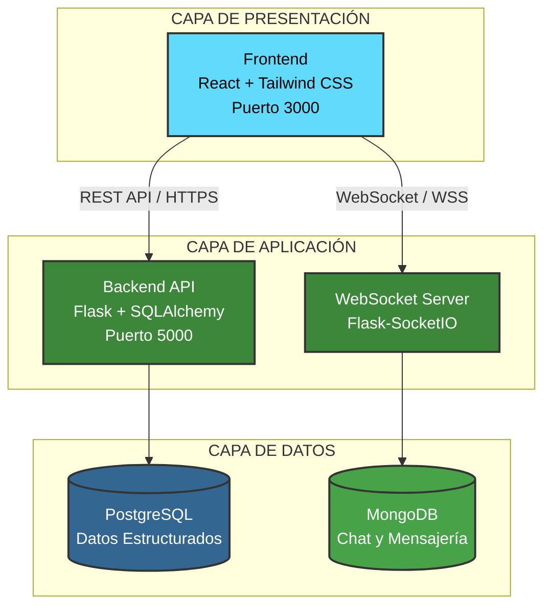
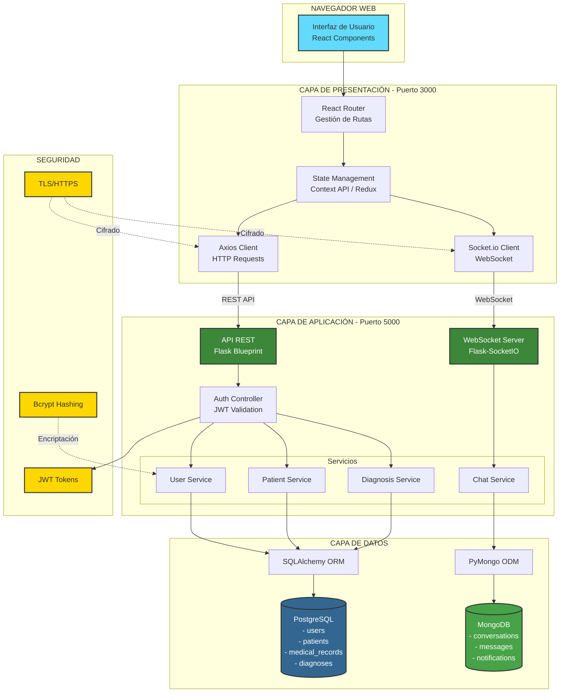

# Software Requirements Specification (SRS)

## dIAgnose - Sistema de Diagnóstico Médico Asistido por IA

**Versión:** 1.0  
**Fecha:** 08/11/2025  
**Preparado por:** LosMasones y MediScout  
**Organización:** IES Ribera del Tajo - Proyecto 2DAM/DAW/IA

---

## Historial de Revisiones

| Fecha | Versión | Descripción | Autor |
|-------|---------|-------------|-------|
| 08/11/2025 | 1.0 | Creación inicial del documento | dIAgnose |

---

## 1. Introducción

### 1.1 Propósito

Este documento especifica los requisitos del sistema dIAgnose, aplicación hospitalaria que integra inteligencia artificial para asistir en el diagnóstico médico. El documento está dirigido al equipo de desarrollo, profesores evaluadores y potenciales usuarios del sistema.

### 1.2 Alcance

dIAgnose es una aplicación web hospitalaria que combina análisis médico tradicional con asistencia de inteligencia artificial.

**Funcionalidades principales:**
- Demo de interfaz gráfica del sistema
- Autenticación y control de acceso
- Gestión completa de datos de pacientes
- Registro y consulta de historiales médicos

**Exclusiones de la versión 1.0:**
- Diagnóstico asistido por IA

### 1.3 Definiciones y Acrónimos

| Término | Definición |
|---------|------------|
| API | Application Programming Interface |
| JWT | JSON Web Token |
| REST | Representational State Transfer |
| CRUD | Create, Read, Update, Delete |
| IA | Inteligencia Artificial |
| RGPD | Reglamento General de Protección de Datos |
| Embeddings | Representaciones numéricas de conceptos médicos |
| WebSocket | Protocolo de comunicación bidireccional en tiempo real |

### 1.4 Referencias

- IEEE 830-1998 / ISO/IEC/IEEE 29148
- RGPD (EU 2016/679)
- Ley Orgánica 3/2018 de Protección de Datos
- Documentación del proyecto: https://github.com/dIAgnoseTeam/dIAgnose

---

## 2. Descripción General

### 2.1 Perspectiva del Producto

dIAgnose es un sistema independiente construido sobre arquitectura de tres capas:

**Componentes de base de datos:**
- PostgreSQL: datos estructurados de médicos y pacientes
- MongoDB: mensajes de chat y conversaciones

### 2.2 Funciones del Producto

**Módulos del sistema:**

| Módulo | Descripción | Acceso |
|--------|-------------|--------|
| Dashboard | Panel principal personalizado | Autenticados |
| Gestión datos de pacientes | Información de pacientes | Personal autorizado |
| Historial Médico | Registro y consulta de historiales | Médicos |

### 2.3 Características de los Usuarios

| Rol | Funciones | Permisos |
|-----|-----------|----------|
| Administrador | Gestión de usuarios y acceso a funcionalidades del sistema | Total |
| Médico | Gestión de datos de pacientes, registro y consulta de historiales médicos | Completo sobre pacientes |

### 2.4 Restricciones

**Legales y normativas:**
- Confidencialidad de datos médicos
- Protección de información sensible de pacientes

**Técnicas:**
- Backend: Python 3.11+ con Flask
- Frontend: React 18+
- Bases de datos: PostgreSQL 13+, MongoDB 5+

**De proyecto:**
- Entorno académico con recursos limitados
- Equipo de 7 desarrolladores estudiantes
- Plazo académico 2025-2026

### 2.5 Suposiciones y Dependencias

**Suposiciones:**
- Conexión estable a Internet
- Dispositivos compatibles (PC, tablet)
- Formación básica de usuarios antes del uso
- Infraestructura de red hospitalaria funcional

**Dependencias externas:**
- Frameworks: React, Tailwind, Flask, SQLAlchemy
- Bases de datos: PostgreSQL, MongoDB

---

## 3. Requisitos Específicos

### 3.1 Requisitos Funcionales

#### RF-001: Demo de Interfaz Gráfica

**Dashboard Principal:**
- Panel personalizado según rol del usuario
- Menú de navegación lateral con acceso a módulos principales
- Barra superior con información del usuario y opción de logout

**Módulo de Historial:**
- Timeline cronológico de consultas médicas
- Vista expandida para detalles completos
- Código de colores para diferentes tipos de consultas

---

#### RF-002: Autenticación y Control de Acceso

**Control de acceso**
- Roles definidos: Administrador, Médico
- Verificación de permisos en cada endpoint del backend
- Rutas protegidas en el frontend
- Registro de intentos de acceso no autorizado

**Gestión de sesiones:**
- Token JWT almacenado en localStorage
- Cierre de sesión manual con invalidación de token
- Cierre automático tras inactividad de 30 minutos

---

#### RF-003: Gestión Básica de datos de Pacientes

- Campos obligatorios: nombre, apellidos, DNI, fecha de nacimiento, teléfono, dirección
- Campos opcionales: email, grupo sanguíneo, alergias
- Vista detallada con todos los datos del paciente
- Asignación automática de ID único interno
- Formulario precargado con datos actuales
- Validación de caso por parte del doctor

---

#### RF-004: Registro y Consulta de Historiales Médicos

**Crear registro de historial:**
- Asociación obligatoria a un paciente existente
- Campos obligatorios: fecha, motivo de consulta, diagnóstico
- Médico responsable y timestamp registrados automáticamente

**Consultar historial:**
- Visualización cronológica inversa (más reciente primero)
- Filtros por rango de fechas y médico responsable
- Vista detallada expandible de cada consulta
- Tiempo de carga máximo: 2 segundos

**Actualizar registro:**
- Solo el médico que creó el registro puede modificarlo
- Campo obligatorio: motivo de modificación
- Histórico de versiones para auditoría
- Confirmación antes de guardar cambios

### 3.2 Requisitos No Funcionales

#### RNF-001: Rendimiento
- Carga de páginas: máximo 2 segundos
- Tiempo de respuesta de API: máximo 1 segundo para operaciones CRUD
- Latencia de mensajería: máximo 1 segundo
- Soporte de 100 usuarios simultáneos
- Capacidad de 10.000 registros de pacientes

#### RNF-002: Seguridad
- Encriptación de contraseñas con bcrypt (mínimo 10 rondas)
- Comunicaciones mediante HTTPS/TLS
- WebSocket sobre TLS
- Conexiones a bases de datos mediante SSL
- Cumplimiento de RGPD
- Logs de auditoría para datos sensibles

#### RNF-003: Usabilidad
- Diseño responsive (desktop, tablet, móvil)
- Accesibilidad WCAG 2.1 nivel AA
- Máximo 3 clics para funciones principales
- Mensajes de error claros y orientados a solución
- Validación de formularios en tiempo real

#### RNF-004: Disponibilidad y Mantenimiento
- Disponibilidad objetivo: 99%
- Backup automático diario
- Código documentado y comentado
- Sistema de logs estructurados con niveles (INFO, WARNING, ERROR)
- Rotación automática de archivos de log

---

## 4. Apéndices

### Apéndice A: Glosario

**Embeddings**: Representaciones numéricas de alta dimensión que capturan el significado semántico de palabras o conceptos. En dIAgnose, se utilizan para representar síntomas y enfermedades.

**JWT (JSON Web Token)**: Estándar abierto para crear tokens de acceso que permiten la autenticación sin estado entre cliente y servidor.

**WebSocket**: Protocolo de comunicación que proporciona canales de comunicación bidireccional sobre una única conexión TCP.

### Apéndice B: Arquitectura del Sistema

**Diagrama de componentes:**

### Apéndice C: Casos de Uso Principales

**Caso de Uso 1: Registro de Consulta Médica**

1. Médico inicia sesión en el sistema
2. Busca y selecciona paciente
3. Accede al módulo de historial médico
4. Crea nueva entrada de consulta
5. Ingresa signos vitales del paciente
6. Registra motivo de consulta y diagnóstico
7. Prescribe tratamiento y observaciones
8. Guarda el registro en el historial
9. Sistema confirma registro exitoso con timestamp

**Caso de Uso 2: Consulta entre Profesionales**

1. Médico A identifica caso complejo
2. Accede al módulo de chat
3. Selecciona a Médico B de contactos
4. Envía mensaje describiendo el caso
5. Médico B recibe notificación instantánea
6. Intercambian información y opiniones
7. Médico A aplica recomendaciones recibidas

### Apéndice D: Consideraciones de Implementación

**Priorización de funcionalidades:**

Fase 1 (MVP):
- Demo de Interfaz Gráfica
- Autenticación y Control de Acceso
- Gestión básica de pacientes (CRUD completo)
- Registro y consulta de historiales médicos

Fase 2:
- Sistema de chat en tiempo real
- Mejoras en la interfaz de usuario

Fase 3:
- Panel de administración completo
- Integración de funcionalidades avanzadas
- Diagnóstico asistido por IA (futuro)

**Stack tecnológico detallado:**

Frontend:
- React 18.2+
- Tailwind CSS 3.0+
- Axios para llamadas API
- Socket.io-client para WebSocket

Backend:
- Python 3.11+
- Flask 2.0+
- Flask-SocketIO
- SQLAlchemy (ORM)
- bcrypt para encriptación
- JWT para tokens

Bases de datos:
- PostgreSQL 13
- MongoDB 5+ 

---

## Aprobaciones

| Rol | Nombre | Fecha |
|-----|--------|-------|
| Equipo LosMasones | Héctor de la Llave Ballesteros | 10/11/2025 |
| Equipo MediScout | Josue Mejías Morante | ___________ |
| Tutor/Profesor | ___________ | ___________ |
